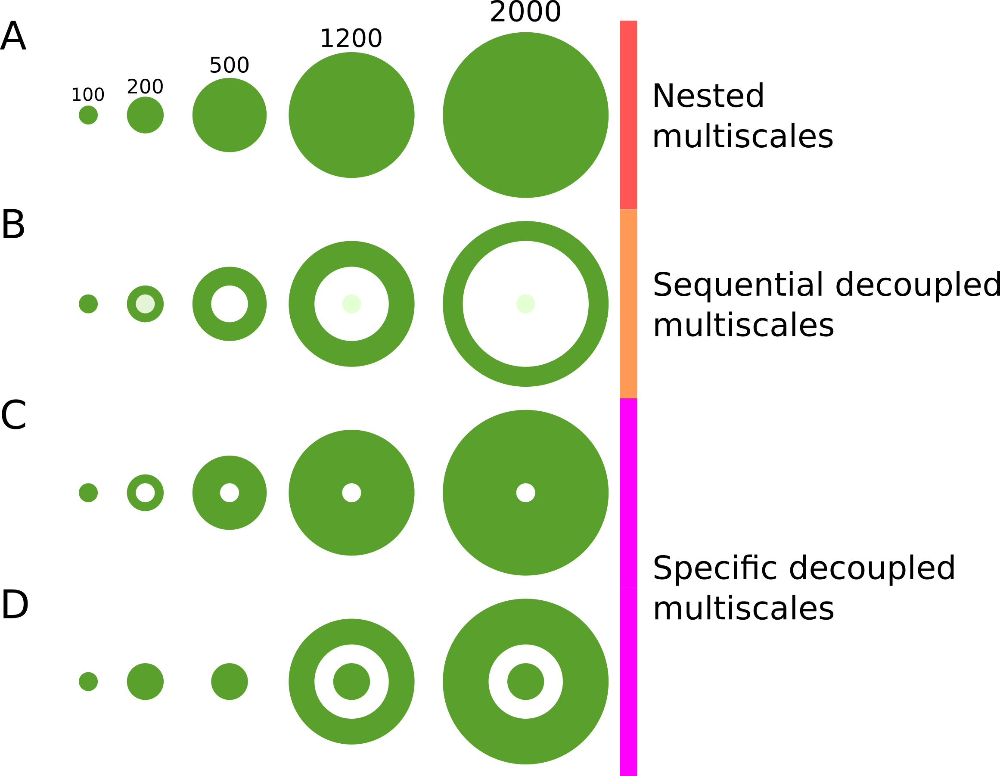

## What is in this vignette?

**Here you will find:**

1. **Introduction**
    - *A little about the concept*
2. **How to use it**
    - *Sequential decoupling*
    - *Specific decoupling*
3. **Compatibility with other packages**


## Introduction

Nested multiscale approaches constitute one of the main tools on the understanding ecological processes and detecting the scale of effect. However, nested approaches inherently retain both the effect and noise of the landscape attributes from the smaller scales as walking toward the larger ones. Therefore, analyzing decoupled scales might reveal detailed ecological responses to landscape context. The idea of decoupled multiscale approaches still poorly explored and the lack of tools specifically designed to deal with is one of the reasons. We designed the _landscapeDecoupler_ to help researchers to achieve this as easy as possible.

### A little about the concept

The image bellow summarizes the main ideas about _coupled/decoupled_ multiscale approaches. You may noticed that the "traditional" nested landscape approach always have the other scales inside it. So, one may be interested in see how composition and structure of each portion of the landscape can contribute to any variable responses. Therefore, users can either use a sequential decoupling landscape strategy (Figure 1, B) or cut out an specific scale and compare against the total (Figure 1, C and D).



The idea of the LandscapeDecoupler is to recursively extract and analyze decoupled buffered scales from a given landscape, returning raster objects, files and basic metrics of the landscape components, so users can easily use rasters and metrics in further analysis.

The package only needs three inputs:     
 1. a classified landscape (a raster)    
 2. lat-long coordinates (a txt or shape [.shp] file);     
 3. two or more buffer sizes to be decoupled (input as vector).    
 
The package also includes some conveniences to plot and export the results.

## How to use it: _"two strategies"_

As mentioned before, the package was designed to manage two decoupling strategies:

One is a "sequential decoupling" strategy, wherein the landscape is sliced using a set of buffers in a progressive way. Therefore, if users input a set of buffers like 250 m, 500 m, and 1000 m, the output will be three raster objects for each given site at the given landscape.

The package also include an second option, which implicates in an "asymmetric decoupling", wherein users might decouple out a specific scale from the landscape. Let's say one would like to compare the composition at a scale between 250 m and 500 m against the everything else from 0 to 3000 m. Then, the user can crop out that specific scale from the whole landscape. The respective raster objects and metrics are so returned separately.

Now lets cover an example:

### Sequential decoupling

We first **load the package**:

```{r}
library(landscapeDecoupler)
```

**Then the landscape:**      
You probably already have a classified raster, if so, you just need to raster() from its path...    
Herein we will load an example from MapBiomas 5.0 collections.

```{r, warning=FALSE}
#1 - loading some raster
file <- system.file("extdata/raster.grd", package="landscapeDecoupler")
r <- raster(file)
#1.1 - making categories
r <- as.factor(r)
```

**Grabbing some meaningful colors**      
The package provide several color pallets from the `grDevices`, but we will load an specific index of colors used by MapBiomas project. This file is a table with corresponding the raster values and colors.    

```{r, warning=FALSE}
#2 - loading the color index file
color.file <- system.file("extdata/colors.txt",
                    package="landscapeDecoupler")
colors <- read.table( color.file , header = T, sep = "\t")
#How it looks like
head(colors)
```


We now find the unique values from the raster and use it to filter only the colors presented in our landscape.        
```{r, warning=FALSE}
#2.1 - creating some breaks to match categories and colors
breaks <- c(as.numeric(levels(as.factor(values(r)))))
#2.2 - matching index values and breaks
colors <- colors[colors$value %in% breaks,]
#2.3 - ordering by values
colors <- colors[order(colors$value),]
```

We can check it by plotting.     

```{r, warning=FALSE}
# A simple plot to see the landscape and categories meaning.
par(mar=c(3,2,3,11))
plot(r, col= colors$hex, legend=F, 
     xpd=T, main="An eight classes raster")
legend(x=268700, y=7600000, 
       legend = paste0(colors$value, ": ", colors$name),
       title = "Values / Categories:", title.adj = 0.05,
       fill = colors$hex, bty = "n", xpd = T)
```

**Now to the points**     

Users can read latitude and longitude files through the `sf` package functions. Users are encouraged to provide an "id" field in shape files in order to keep custom site names. Otherwise, sites will be sequentially named.

In this example we will load an simple txt file, with three columns: id, x and y. Lists of sites are also very common and the function `read_points` is able to handle txt file like this. 

```{r}
#2 - reading points
points.file <- system.file("extdata/points.txt", package="landscapeDecoupler")
p <- read_points(points.file,type="txt",id="id",lat="x",long="y", delimiter="\t")
plot(r, col=colors$hex, legend=FALSE)
points(p, pch=19, col="black")
text(p, p$id, adj=c(0.5,-0.5), font=2, col="black", cex=1.1)
```

> In any analysis of spatial data it's a good practice to keep coordinate systems consistent. Shape files usually already have a crs assigned, but users might be shure using the code bellow.

```{r}
crs(p)<-crs(r)
```

**And buffers:**

Users must provide a set of buffers (> 2) to be cropped out of the landscape. It must be provided in a sequential and increasing order, as the example bellow.

```{r}
#Setting the buffer sizes
b <- c(250, 500, 1000, 1500)

#To plot buffers
ps  <- st_as_sf(do.call(rbind, replicate(4,p)))
bfs <- st_buffer(ps, rep(b, each=4))
#calling the plots
plot(r, col=colors$hex)
points(p, pch=16, col="blue", cex=0.5)
plot(bfs$geometry, add=T)

```

> Users can provide any set of buffers, but you must bear in mind that the final landscapes (scales) are calculated as the difference between sequential buffers (excepting the one corresponding to the core, usually the first). Thus, the first scale (250) will be a circle with 250 m radius from the sites we provided, but the second scale (500) will be the 500 m radius circle less the first buffer (250); Likewise, the third buffer, 1000 m less the 500 m, and so on through the list.


Now we can run the main function of the package, asking for decoupling a landscape `r` at a site `p` with a set of buffers `b`.


```{r, echo=T, warning=FALSE, results='hide'}
multiscales <- decouple(r, p, b)
```

> It might take a couple seconds or minuts depending on the resolution of the raster, the number of sites and buffers.

We can take a look at the object returned. It is a list of several raster objects ( _`p`_ x _`b`_). The first level correspond to each site and the second level to each buffer.

Raster names follow the format _"id_bufferSize"_. So the first buffer in our example will be the **s1_250**, then **s1_500**, and so on...

```{r, include=F}
head(multiscales, 1)
#for Rstudio users
#View(multiscales)

```

As any list, we can access specific elements with a very simple syntax. Let's say we would like to access the raster object from the buffer 500 at the site s1. We only have to use a command like this:

```{r}
multiscales[[1]][[2]]
```

> Note that the buffers follow the order we used in the parameters. In this example the multiscales[[1]][[1]] represent the buffer of 250 m at the site p01; multiscales[[1]][[2]] the one of 500 m; multiscales[[1]][[3]] = 1000 m and multiscales[[1]][[4]] = 1500. The same might be applicable for any other site just using multiscales[[2]][[1]], so on...

We can extract very basic information of the raster with the function `extract_metrics` just like bellow:

```{r}
metrics <- extract_metrics(multiscales, countNA = "no")
metrics[[1]]
```

Just like the output from `decouple`, the output from `extract_metrics` is a list of data.frames with very basic stats, like the counting of a specific class, its percentage, total number of classes in a given scale and compositional heterogeneity.

Finally we can plot it. The package has a wrapper for the native `plot` function which will allow us to plot some sets of scales directly.

```{r}
#to plot everything
plot_decoupled(multiscales)

```

To plot scales from a particular site, changing the color pallet...   
```{r}
plot_decoupled(multiscales[[1]], pallete = "viridis")
```

Plotting with different layouts (cols and rows) and custom colors.

```{r}
#All plots in a 4x4 grid
plot_decoupled(multiscales, rows = 4, cols =4, 
               legend = T,
               colors = colors$hex, 
               breaks = breaks)
```

At last, we can save the decoupled scales in local files to access in other software or packages.

```{r, include=T, eval=FALSE, warning=FALSE}
write_scales(x = multiscales, buffer.names = b, format = 'GTiff')
```

### Specific decoupling

Users might want to decouple specific scales, for instance, decouple a scale between 250 and 500 m out of a landscape with 1500 m radius total. In the LandscapeDecouple package it is simply done as bellow:

```{r, warning=FALSE, message=FALSE}
b<-c(250, 500, 1000, 1500)
specific.scales <- decouple(r, p, b, dec.specific = c(2))
#you can also decouple more scales at once, like this
#specific.scales <- decouple(r, p, b, dec.specific = c(2,4))
```

for visual inspection, the user can plot the resulted scales at the site 01:

```{r}
plot_decoupled(specific.scales[[1]], 
               rows=1, cols=3,
               colors = colors$hex, 
               breaks = breaks)
```

It is easy to see that we are fully able to compare any information from one scale related to the whole left. You may also notice that the name of the "nonspecific" scale is a concatenation of two other buffers we used to configure our landscape.

If we extract the metrics from these two raster it will seems like this:

```{r}
specific.scales.metrics <- extract_metrics(specific.scales)

specific.scales.metrics[[1]]

```

Here above we can see three data frames, one with the data from the 500m buffer, other with 1500 and a third with the buffers left from the sampling site s1.

## Compatibility with other packages

The output of the `decouple` function is an list of raster, so users can take advantage of R list functionalities to work with different packages and operations.

### Ploting with other packages

Users can plot `decouple` output with different packages, including `R base` and `tmap`, for instance...

You just need to stack the list or make sure you are pointing to an specific raster item on the list.

**For R base / raster package plot**

```{r}
#For R base
plot(specific.scales[[1]][[2]])
#or plot (multiscales[[1]][[4]])

```

Using `plot(specific.scales[[1]])` or `plot(multiscales[[1]])` will not work because both point to an list of lists.

There are two ways to workaround. First, using `plot_decoupled` as mentioned before, or using `stack`.

**Plotting stacks**

An example with our object `specific.scales`

```{r}
map1 <- stack(specific.scales[[1]])
plot(map1)
```

And `multsicales` as well

```{r}
#same for multiscales:
map2 <- stack(multiscales[[1]])
plot(map2)
#alternatively: plot(stack(multiscales[[1]]))
```

**Plotting with tmap**

`tmap` is a quite popular map plotting package and can be easily used to produce more elaborated plots:

```{r}
library("tmap")
#creating and stack
map1 <- stack(specific.scales[[1]])
#checking the categories in this stack
mapcat <- levels(as.factor(values(map1)))
#filtering colors that match with stacks
mapcols <- colors[ colors$value %in% mapcat ,]
#now plotting
tm_shape(map1) +
  tm_raster(style = "cat",
            pal = mapcols$hex,
            title = "Values / Categories:",
            labels = paste0(mapcols$value, ": ", mapcols$name)) +
  tm_compass() +
  tm_scale_bar() +
  tm_grid(n.y=3, n.x=3, lines = FALSE, labels.rot = c(0, 90)) +
  tm_layout(legend.outside = T, 
            legend.outside.position = "bottom")
```


### Calculating metrics with other packages

Once the user has defined the desired level of comparison and extract his landscape, one might want to proceed with more complex analysis. Other packages as `LandscapeMetrics` might be used to calculate landscape properties.

We can provide the output from the `LandscapeDecoupled` as input into functions as `calculate_lsm`, since the output is a raster object. Users might do this as follows:

```{r, warning=FALSE}
library("landscapemetrics")
area <- calculate_lsm(specific.scales[[1]], level = "class", metric = "area")
#Just to show you who are layers 1 and 2 for the landscapeMetrics
paste0("layer", c(1:2),": ", lapply(specific.scales[[1]],names))
area[area$metric=="area_mn",  ]

#You can also do like this:
#landscapes <- stack(specific.scales[[1]])
#area<-calculate_lsm(landscape, level = "class", metric = "area")
#area
```

As you can see, `landscapeMetrics` understand the list of two raster objects we gave to it as layers. Therefore, the first layer represents the s1_500 and the layer two is the s1_250_s1_1500.

To go forward through your sites you only have to change the index in the list of raster objects, to grab data from site 2 you can do like this:

`specific.scales[[2]]`


## So, now what?

Here you go with basics. Decoupled multiscale approach has a huge potential to lightening several ecological aspects. Now, you can grab your data and have fun!

I hope you find it helpful and useful, but if you end up on any crash or may have a bad time trying to run this code, please fell free to mail me.

## References

Some published papers about the methodology and how to use it:

**Bee responses to landscape composition on coupled and decoupled multiscale approaches**     
_Lazaro Carneiro, Milton Cezar Ribeiro, Willian Moura de Aguiar, Camila de Fátima Priante, Wilson Frantine-Silva, Maria Cristina Gaglianone_      
[Preprint](https://www.researchsquare.com/article/rs-750143/v1)

**The Interplay Between Thematic Resolution, Forest Cover, and Heterogeneity for Explaining Euglossini Bees Community in an Agricultural Landscape**     
_Lázaro da Silva Carneiro, Willian Moura de Aguiar, Camila de Fátima Priante, Milton Cezar Ribeiro, Wilson Frantine-Silva and Maria Cristina Gaglianone_      
[https://www.frontiersin.org/articles/10.3389/fevo.2021.628319/full](https://www.frontiersin.org/articles/10.3389/fevo.2021.628319/full)


Dr. Wilson Frantine-Silva     
<wilsonfrantine@gmail.com>      
Universidade Estadual do Norte Fluminense, Campos dos Goytacazes, RJ - BR 
LCA, PPGERN, EcoExperimental.   
Laboratório de Ecologia de Abelhas e Polinização.     
